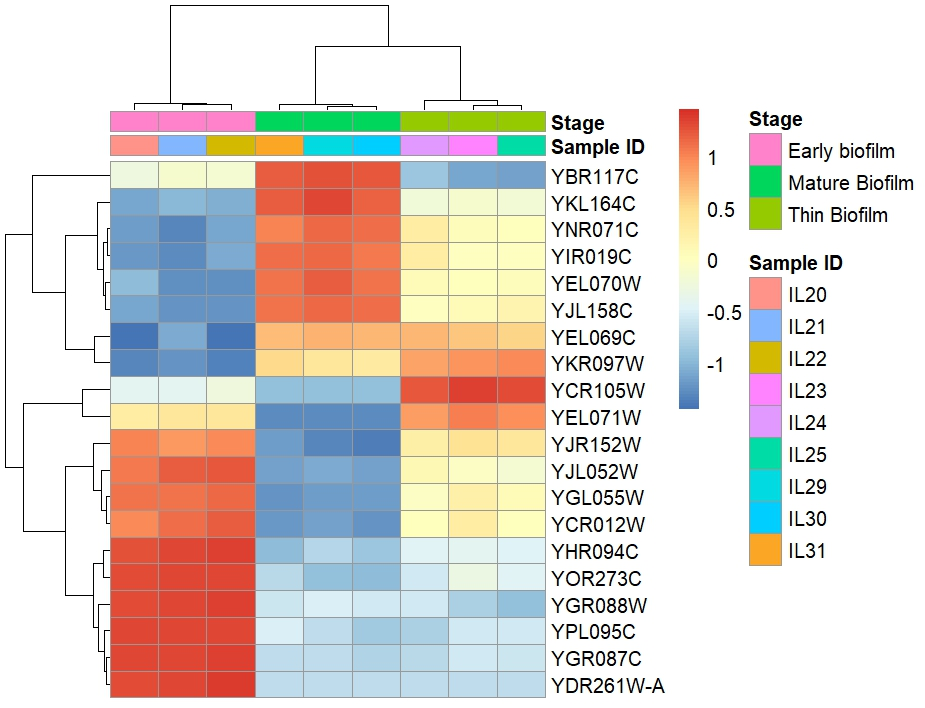

# Differential Gene Expression of Yeast Biofilm during Wine Aging

Differential gene expression is the process by which cells with the same genome activate different genes for different adaptations and functions, and studying it allows us to better understand cell differentiation, gene regulation, and adaptation to environments (Gilbert, 2000). The purpose of this project is to research the best methods, software, and parameters for gene expression analysis and to use bulk transcriptomics data to study differential gene expression in yeast biofilm during wine aging.

Velum refers to a surface film formed by yeast (*Saccharomyces cerevisiae*) that grow on top of a liquid, especially in winemaking. It is important to study because it dictates the release of aromatic compounds, shapes the wine’s mouthfeel, and defines its stability and longevity. It also shows how the yeast adapts to high ethanol environments, consumes ethanol and glycerol, and forms a protective, metabolically active biofilm. This helps to optimize the process of producing quality wine and to understand the biological mechanisms involved (Mardanov et al., 2020).

In order to properly study how gene expression affects this process, we must use appropriate and effective tools and software for the data provided to achieve accurate results.

## Methods Comparison

A 2021 study carried out by NASA GeneLab shows FastQC as a reliable quality control tool for short-read sequencing data, as it provides information that allows users to assess sample and sequencing quality, including base statistics, per-base sequencing quality, per-sequence quality scores, per-base sequence content, per-base GC content, per-sequence GC content, per-base N content, sequence length distributions, sequence duplication levels, overrepresented sequences, and k-mer content (Overbey et al., 2021). The outputs from this tool can also be combined to produce a multiqc report comapring structure of multple sequence files. 

Another 2024 study showed STAR to be a superior aligner with an accuracy of 90% when compared to other aligners for RNA-Seq data  (Coxe et al., 2024).

A comparison study of quantification tools showed RSEM to be the best quantifier when compared with tools like Salmon and NanoString, with low absolute mean error values however it was slower than the pseudoaligners (Germain et al., 2016).

Finally, an evaluation of RNA-seq differential analysis methods showed that DESeq2 performs best when the sample size is six or higher per group, offering the best balance of FDR control, power, and stability (Li et al., 2022).

This is optimal for our data structure, as we have nine different samples, and these methods can provide strong statistical results.
# Methods

## Data Acquisition

The dataset used for this analysis was obtained from the NCBI database under BioProject accession PRJNA592304. It consisted of nine samples in SRR file format representing the three stages of biofilm development (Early, Thin, and Mature biofilm). SRR files were converted to FASTQ files using SRA Toolkit Release 3.3.0 (The Sequence Read Archive (SRA), n.d.). The reference genome and annotation for *Saccharomyces cerevisiae* were obtained from the NCBI FTP website in FASTA and GTF format.

## Quality Control

Quality control checks were performed using FastQC v0.12.1 for each individual FASTQ file and were viewed collectively using MultiQC v1.33 (Babraham Bioinformatics - FastQC A Quality Control Tool for High Throughput Sequence Data, n.d.; Ewels et al., 2016).

## Alignment

Alignment was performed using STAR v2.7.11b and involved two steps. The first step was generating the genome index using `--runMode genomeGenerate`. The second step involved aligning reads, with the key option being `--quantMode TranscriptomeSAM` to produce BAM files aligned to the transcriptome (Dobin et al., 2013).

## Quantification

Quantification was performed using RSEM v1.3.3 by preparing the reference with the `rsem-prepare-reference` command using the reference FASTA and GTF files. This reference was then supplied to the `rsem-calculate-expression` command to quantify gene counts for the aligned files, using the `--bam` option to specify input. This produced gene-level and isoform-level count files (Li & Dewey, 2011).

All bash shell scripting code can be found in the [transcriptomics.sh](transcriptomics.sh) script file.

## Differential Analysis

Differential expression analysis was performed using DESeq2 v1.44.0 in R v4.5.1. Gene count files generated from quantification were imported using tximport v3.21. DESeq2 was used to produce pairwise comparisons among the three stages (Early, Thin, and Mature). The model was also subjected to a Likelihood Ratio Test (LRT) to assess how inclusion of Stage improved model fit (Love et al., 2014).

## Functional Annotation

Functional annotation was performed using the clusterProfiler R package v4.14.3 to conduct Gene Ontology (GO) overrepresentation analysis. The results data frame from the differential analysis LRT was used to identify biological processes significantly associated with Stage and to compute upregulated and downregulated genes. The gene mapping uses ORF and compares to Genename in the Org.Sc.sgd.db database for yeast. (Wu et al., 2021).

## Data Visualization

Data structure and results were visualized using R packages including ggplot2 v4.0.2, pheatmap v1.0.13, and enrichplot v1.31.4 (Bioconductor - Enrichplot, n.d.; “The Grammar of Graphics,” 2005; Kolde, 2025).

All R Code can be found in the [Deseq R Script](Deseq%20R%20script.R).

## Results
### Quality Assessment
Quality assessment of raw sequencing reads was performed using FastQC and summarized with MultiQC. Per-base sequence quality scores across all samples were consistently high, with the majority of bases exhibiting Phred quality scores above 30. Per-sequence quality score distributions were tightly clustered, with the majority of reads falling within high-confidence score ranges. Per-base N content was negligible across all samples. The proportion of ambiguous nucleotides (N) remained near zero across read positions, without position-specific spikes. Collectively, these quality metrics demonstrate that the sequencing data are of high technical quality and suitable for differential gene expression analysis without extensive quality trimming. 
Reports can be seen at [QC reports](https://iroayotoki2.github.io/Transcriptomics/).

### Data Structure  
 The data structure is well described by the PCA plot that shows that 67% of the variance can be described by the first principal component with the stage groups also distributed  sequentially across this principal component. This infers that the variance is heavily dependent on the stage of the samples and accounts for majority of the variance while the second principal component accounts for 24% of the variance with a spike in the thin biofilm group compared to the other groups the groups are also closely clustered together which infers there is little variance within each sample group

 
Figure 1: A PCA plot showing PC1 accounting for 67% of variance and PC2 accounting for 24% with the samples grouped by stage into early, thin and mature biofilms. Strong clusters within groups indicate that internal grouping of stage account for majority of the variance. 

### Differential Expression
The results from Pairwise analysis showed that the greatest changes occured when comapring mature with early biofilm with 1853 genes upregulated and 1740 downregulated genes while the smallest changes were seen in the thin vs early biofilm comparisons with 1339 upregulated genes and 1273 downregulated genes. This suggests that developmental stage is the dominant factor in gene expression as seen here.

| Comparison          | Upregulated (LFC > 0) | Downregulated (LFC < 0) | Outliers | Low Counts |
|---------------------|-----------------------|--------------------------|----------|------------|
| Mature vs Thin      | 1520 (23%)            | 1432 (21%)               | 3 (0.044%) | 260 (3.9%) |
| Mature vs Early     | 1853 (27%)            | 1740 (26%)               | 3 (0.044%) | 0 (0%)     |
| Thin vs Early       | 1339 (20%)            | 1273 (19%)               | 3 (0.044%) | 127 (1.9%) |

Table 1: A Table comparing upregulated vs downregulated values in the differential gene expression across different developmental stages of the Yest biofilm with the greatest change occuring in the Mature vs Early comparison.

In order to further investigate the gene expression, a likelihood ratio test was carried out on the data to see how much stage improves the model. The results from this show  interesting patterns where some highly significant genes like YBR117C, YKL164C had a significant increase in expression at the thin biofilm stage and dropped in the mature stage. This is also in support of how the data is structured from the PCA plot in where there is a spike in the thin biofilm in PC2 when compared to the other stage groups. Genes uniquely upregulated in the Thin biofilm stage  suggest stage-specific biological processes associated with biofilm restructuring and metabolic adaptation.

Figure 2: A heatmap comparing mean expression from 1(orange) to -1(blue) showing most significantly correlated genes in the effect of stage on the model. This shows some unique patterns in some genes where there is a spike between early and thin biofilm stages and a drop at the mature stage and in some other genes there is a progressive decrease across genes from early to mature stages.
The pairing of the sample IDs to their respective SRA Accessions can be found in the [Metadata](Stage_Metadata.csv) file.

### Functional Annotation
Functional annotation analysis of differentially expressed genes revealed strong enrichment of processes related to protein synthesis and mitochondrial function. Gene Ontology Biological Process (GO BP) overrepresentation analysis showed that both upregulated and downregulated gene sets were significantly enriched for translation, cytoplasmic translation, ribosome biogenesis, ribonucleoprotein complex biogenesis, and rRNA metabolic processes. Terms associated with mitochondrial translation, mitochondrial gene expression, cellular respiration, and aerobic respiration were also prominently represented. The high enrichment of ribosomal and translational processes indicates substantial remodeling of the protein synthesis machinery across stages. Concurrent enrichment of mitochondrial organization and respiratory pathways suggests coordinated regulation of energy metabolism. Collectively, these results demonstrate that biofilm development is accompanied by extensive shifts in translational capacity and mitochondrial activity, reflecting dynamic metabolic and structural adaptation during stage progression.

Figure 3 Barplot showing the most significant upregulated genes related to the biological processes where there a heavy tilt in the direction of protein synthesis and respiratory function with translation having the highest gene counts and ribonucleoprotein complex biogenesis also having high gene counts.

Figure 4  Barplot showing the most significant downregulated genes related to the biological processes shwoing strong enrchment  of protein synthesis and respiratory function with translation having the highest gene counts and ribonucleoprotein complex biogenesis also having high gene counts.

## Discussion
This analysis allows us to understand the biological processes and important genes associated with the development of yeast biofilm and to elaborate on this a few significant  genes will be discussed in this section.

YBR117C (TKL2) shows a spike in Thin. This gene encodes transketolase 2, an enzyme of the non-oxidative branch of the pentose phosphate pathway (PPP). The PPP  generates ribose-5-phosphate for nucleotide synthesis and contributes to NADPH production, which is crucial for redox balance and biosynthetic reactions. A Thin-stage spike in YBR117C suggests increased flux through carbohydrate rearrangement pathways to support biosynthetic adaptation. During biofilm restructuring, cells often need nucleotide precursors and reducing power for cell wall remodeling and stress resistance. Upregulation of PPP enzymes has been linked to oxidative stress tolerance and metabolic reprogramming in yeast (Krüger & von Schaewen, 2003; Jain et al., 2012). This shows that the thin stage  may represent a metabolically plastic state demanding redox buffering and precursor synthesis.

YKL164C (MNR2) also spikes in Thin. MNR2 encodes a vacuolar membrane protein involved in magnesium homeostasis. Altered magnesium transport often reflects ionic stress or shifts in intracellular metabolic demand. Increased MNR2 expression has been associated with magnesium storage and mobilization under nutrient-limited conditions (Pisat et al., 2009). A Thin-stage increase may therefore reflect ionic adjustment during biofilm structural transition, possibly compensating for environmental gradients within developing biofilms. Cells reorganizing their metabolic and translational machinery would require tight Magnesium regulation.

Furthermore , YHR094C (HXT1) shows a decline from Early. HXT1 encodes a low-affinity glucose transporter that is typically expressed under high-glucose conditions. Its expression is strongly induced when glucose is abundant and repressed as glucose becomes limiting (Ozcan & Johnston, 1999). A decline from Early suggests decreasing extracellular glucose availability or a shift away from fermentative metabolism. In biofilm development, early stages may experience higher nutrient exposure, whereas later stages experience gradients and localized depletion. Reduced HXT1 expression is therefore consistent with a metabolic transition away from high-glucose fermentation toward alternative carbon usage or respiratory metabolism.

Thin appears to represent a metabolic rebalancing phase characterized by enhanced redox and precursor metabolism (via TKL2), ionic homeostasis adjustment (via MNR2), and reduced reliance on high-glucose uptake pathways (via declining HXT1). This pattern is consistent with a shift from rapid, glucose-driven early growth toward a structurally and metabolically reorganized biofilm state.

The enriched GO Biological Processes provide functional context that coherently supports the expression patterns observed for YBR117C (TKL2), YKL164C (MNR2), and YHR094C (HXT1). The strong enrichment of translation, ribosome biogenesis, rRNA processing, and mitochondrial gene expression indicates global remodeling of biosynthetic and respiratory capacity during stage progression. Upregulation of TKL2 during the Thin stage aligns with enrichment of metabolic and biosynthetic GO terms, as increased pentose phosphate pathway activity supplies ribose-5-phosphate for nucleotide synthesis and NADPH for reductive biosynthesis and oxidative stress buffering (Krüger & von Schaewen, 2003). 

Similarly, the Thin-stage increase in MNR2 expression is mechanistically consistent with enrichment of ribosomal and mitochondrial processes, since magnesium is essential for ribosome stability and ATP-dependent reaction, the   regulation of magnesium homeostasis supports shifts in translational and respiratory demand (Pisat et al., 2009). Also, the decline of HXT1 from Early corresponds with enriched mitochondrial and aerobic respiration terms, suggesting a transition away from high-glucose fermentative metabolism toward oxidative metabolism, a well-characterized adaptive response in yeast as glucose availability decreases (Ozcan & Johnston, 1999; DeRisi et al., 1997). Together, the GO BP enrichment patterns reinforce the gene-level observations, indicating coordinated metabolic reprogramming involving carbohydrate flux redistribution, ionic regulation, translational capacity adjustment, and respiratory adaptation during biofilm development.

## Conclusion
This study demonstrates that biofilm development in Saccharomyces cerevisiae is accompanied by coordinated and stage-dependent transcriptional reprogramming. Differential gene expression analysis revealed substantial shifts between Early, Thin, and Mature stages, with the largest transcriptional divergence observed between Mature and Early biofilms. Functional enrichment analysis showed that translational machinery, ribosome biogenesis, rRNA processing, and mitochondrial respiration were among the most significantly regulated biological processes, indicating dynamic remodeling of protein synthesis capacity and energy metabolism during biofilm progression.

Gene-level patterns further supported this system level interpretation. Thin stage specific increases in genes associated with pentose phosphate pathway activity and magnesium homeostasis suggest metabolic plasticity and cellular restructuring during transitional biofilm development. Concurrent modulation of glucose transport and respiratory pathways reflects adaptive shifts in carbon utilization and energy production. Together, these findings indicate that biofilm maturation is not a passive accumulation of biomass but rather an actively regulated process involving metabolic reconfiguration, translational adjustment, and respiratory adaptation.

Overall, the integration of differential expression analysis with Gene Ontology enrichment provides a coherent framework for understanding the transitions underlying yeast biofilm development.

## References
Babraham Bioinformatics - FastQC A Quality Control tool for High Throughput Sequence Data. (n.d.). Retrieved March 1, 2026, from https://www.bioinformatics.babraham.ac.uk/projects/fastqc/

Coxe, T., Burks, D. J., Singh, U., Mittler, R., & Azad, R. K. (2024). Benchmarking RNA-Seq Aligners at Base-Level and Junction Base-Level Resolution Using the Arabidopsis thaliana Genome. Plants, 13(5), 582. https://doi.org/10.3390/plants13050582

DeRisi JL, Iyer VR, Brown PO. 1997. Exploring the metabolic and genetic control of gene expression on a genomic scale. Science.

Dobin, A., Davis, C. A., Schlesinger, F., Drenkow, J., Zaleski, C., Jha, S., Batut, P., Chaisson, M., & Gingeras, T. R. (2013). STAR: ultrafast universal RNA-seq aligner. Bioinformatics (Oxford, England), 29(1), 15–21. https://doi.org/10.1093/bioinformatics/bts635

Ewels, P., Magnusson, M., Lundin, S., & Käller, M. (2016). MultiQC: summarize analysis results for multiple tools and samples in a single report. Bioinformatics, 32(19), 3047–3048. https://doi.org/10.1093/bioinformatics/btw354

Germain, P. L., Vitriolo, A., Adamo, A., Laise, P., Das, V., & Testa, G. (2016). RNAontheBENCH: computational and empirical resources for benchmarking RNAseq quantification and differential expression methods. Nucleic Acids Research, 44(11), 5054. https://doi.org/10.1093/nar/gkw448

Gilbert, S. F. (2000). Differential Gene Expression. https://www.ncbi.nlm.nih.gov/books/NBK10061/

Jain M et al. 2012. Metabolite profiling identifies a key role for glycine in rapid cancer cell proliferation. Science.

Krüger NJ, von Schaewen A. 2003. The oxidative pentose phosphate pathway: structure and organisation. Curr Opin Plant Biol.

Li, B., & Dewey, C. N. (2011). RSEM: accurate transcript quantification from RNA-Seq data with or without a reference genome. BMC Bioinformatics, 12, 323. https://doi.org/10.1186/1471-2105-12-323

Li, D., Zand, M. S., Dye, T. D., Goniewicz, M. L., Rahman, I., & Xie, Z. (2022). An evaluation of RNA-seq differential analysis methods. PLOS ONE, 17(9), e0264246. https://doi.org/10.1371/journal.pone.0264246

Mardanov, A. V., Eldarov, M. A., Beletsky, A. V., Tanashchuk, T. N., Kishkovskaya, S. A., & Ravin, N. V. (2020). Transcriptome Profile of Yeast Strain Used for Biological Wine Aging Revealed Dynamic Changes of Gene Expression in Course of Flor Development. Frontiers in Microbiology, 11, 538. https://doi.org/10.3389/fmicb.2020.00538

Overbey, E. G., Saravia-Butler, A. M., Zhang, Z., Rathi, K. S., Fogle, H., da Silveira, W. A., Barker, R. J., Bass, J. J., Beheshti, A., Berrios, D. C., Blaber, E. A., Cekanaviciute, E., Costa, H. A., Davin, L. B., Fisch, K. M., Gebre, S. G., Geniza, M., Gilbert, R., Gilroy, S., … Galazka, J. M. (2021). NASA GeneLab RNA-seq consensus pipeline: standardized processing of short-read RNA-seq data. IScience, 24(4), 102361. https://doi.org/10.1016/j.isci.2021.102361

Ozcan S, Johnston M. 1999. Function and regulation of yeast hexose transporters. Microbiol Mol Biol Rev.

Pisat NP et al. 2009. Mnr2 is a vacuolar magnesium transporter in Saccharomyces cerevisiae. Eukaryot Cell.

The Sequence Read Archive (SRA). (n.d.). Retrieved March 1, 2026, from https://www.ncbi.nlm.nih.gov/sra/docs/
